<div align="center">

#  I2C Protocol in Verilog

### A beginner-friendly, step-by-step Verilog implementation of the I2C protocol
**Built one small block at a time → assembled into a full Master & Slave → deployed on real FPGA hardware.**

[](.)
[](.)
[](.)
[](.)


*If you're learning digital design, FSMs, or communication protocols — read this repo top to bottom like a tutorial, not just clone-and-run.*

</div>

---

## 📖 Table of Contents

- [🧠 What is I2C?](#-what-is-i2c)
- [🎞️ The I2C Frame, Animated](#️-the-i2c-frame-animated)
- [🪜 How the Learning Path is Organized](#-how-the-learning-path-is-organized)
- [🗂 Repository Structure](#-repository-structure)
- [🧩 Building Blocks (`I2C_master/`)](#-building-blocks-i2c_master)
- [🔗 Putting It Together — Master FSM](#-putting-it-together--master-fsm)
- [🎯 The Slave (`I2C_slave/`)](#-the-slave-i2c_slave)
- [🛠 Hardware Implementation (FPGA)](#-hardware-implementation-fpga)
- [▶️ How to Simulate](#️-how-to-simulate)
- [🧾 Signal Cheat Sheet](#-signal-cheat-sheet)
- [🗺 Suggested Learning Order](#-suggested-learning-order)

---

## 🧠 What is I2C?

**I2C (Inter-Integrated Circuit)** is a 2-wire serial protocol used to connect chips together — sensors, displays, EEPROMs, RTCs, and more.

| Line | Name | Purpose |
|:---:|:---|:---|
| 🟡 **SCL** | Serial Clock | Times when each bit is valid |
| 🟢 **SDA** | Serial Data | Carries the actual bits |

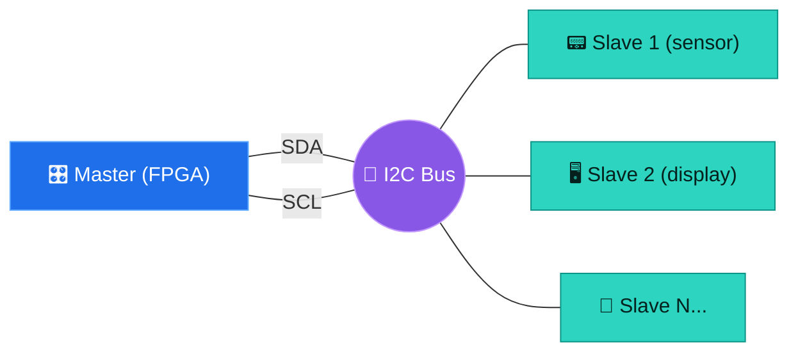

> Both lines are **open-drain** — any device can pull them low, but nobody drives them high (a pull-up resistor does that). That's why you'll see `1'bz` used constantly in this codebase instead of ever driving a `1` directly.

---

## 🎞️ The I2C Frame, Animated

These are **live-rendered SVG waveforms** (not static screenshots) — the red cursor sweeps across the bus in real time and the labels light up exactly when that event happens, just like reading a logic analyzer trace.

> 💡 Add the generated `.svg` files (bundled alongside this README) into a `docs/waveforms/` folder in the repo so the images below resolve.

### 1️⃣ START Condition
SDA falls **while SCL is still high** — the one and only signature the bus watches for.

<p align="center">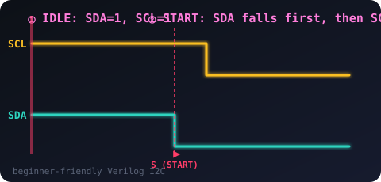</p>

```verilog
// START_BIT/start_bit.v — the whole idea in one transition
if (stat_en) sda <= 1'b0;   // pull SDA low while scl is still 1'b1
```

### 2️⃣ Slave Address + R/W bit
The master shifts out the **7-bit address MSB-first**, followed by the **R/W bit** (`0`=write, `1`=read).

<p align="center">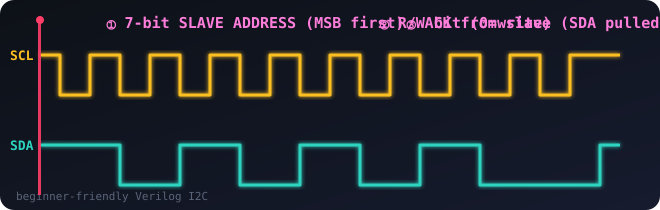</p>

### 3️⃣ ACK — Slave Acknowledges
The master **releases** SDA (`1'bz`); if the slave pulls it low, that byte was received.

<p align="center">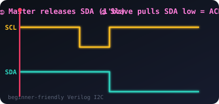</p>

### 4️⃣ NACK — No Acknowledge
Same release — but this time **nobody pulls SDA low**, so it floats high. Used to end a read, or signals an error.

<p align="center">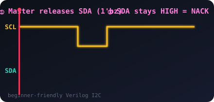</p>

### 5️⃣ STOP Condition
SDA rises **while SCL is high** — the mirror image of START, and how every transaction ends.

<p align="center">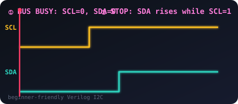</p>

> 🔑 **Key idea:** SDA may only change while SCL is **low** for normal data bits. SDA changing while SCL is **high** is reserved exclusively for START and STOP — that's what makes those two conditions unambiguous on a shared bus.

### The full frame, sequenced

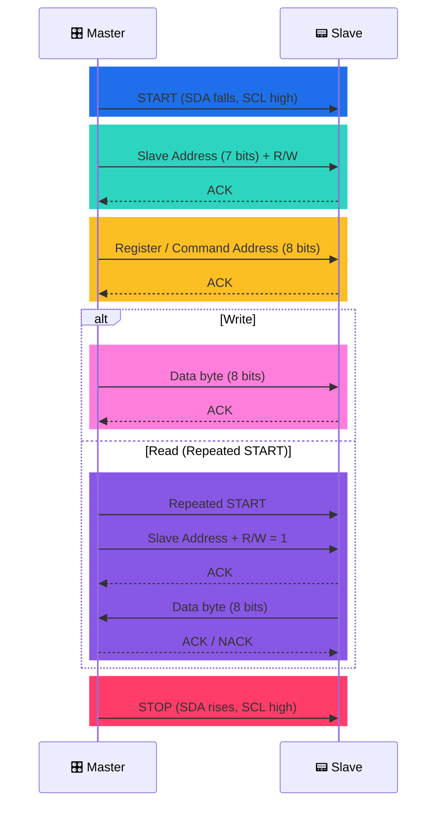

---

## 🪜 How the Learning Path is Organized

This project doesn't jump straight to a finished I2C master — it teaches by **decomposition**.

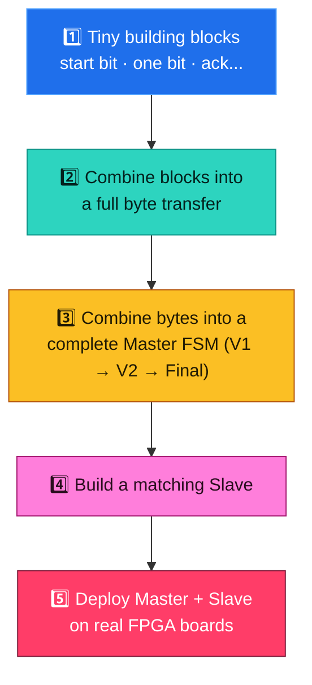

Every small block in `I2C_master/` ships with its own **module + testbench + waveform screenshot**, so you can simulate and see exactly what one piece does before trusting it inside the bigger design.

---

## 🗂 Repository Structure

```text
I2C_PROTOCOL_IN_VERILOG/
│
├── 🧩 I2C_master/                   ← Learn the MASTER, piece by piece
│   ├── START_BIT/                  → generates the I2C START condition
│   ├── data_transfer/
│   │   ├── send_bit/               → sends a single bit
│   │   ├── send_byte/              → sends 8 bits (uses send_bit)
│   │   └── read_byte/              → reads 8 bits from the slave
│   ├── ack/
│   │   ├── ack.v                   → master checks slave's ACK/NACK
│   │   ├── master_ack/             → master sends ACK (after reading)
│   │   └── master_nack/            → master sends NACK (end of read)
│   ├── Repeated_START/             → START without a STOP in between
│   ├── stop/                       → generates the I2C STOP condition
│   ├── I2C_Master V1/              → 1st full master (write-only)
│   ├── I2C_Master V2/              → 2nd full master (adds read + ack/nack)
|   ├── I2C_Master_multy-byte_Read/                → master with Multi Read  + testbench vs a slave model
|   ├── I2C_Master_multy-byte_Read_and_write/      → master with Multi Read and Write + testbench vs a slave model
│   └── I2C_Master_single_byte_Read&write/         → master with Single Read and Write + testbench vs a slave model
│
├── 🎯 I2C_slave/                    ← Learn the SLAVE, piece by piece
│   ├── slave_start_stop_detect.v   → detects START / STOP on the bus
│   ├── slave_receive_byte.v        → receives a byte (write from master)
│   ├── slave_send_byte.v           → sends a byte (read by master)
│   ├── slave_ack.v                 → slave generates ACK
│   └── i2c_slave.v                 → top-level slave FSM
│
├── 🛠 Hardware_Implementation/
│   └── FPGA_Single_Slave/          ← Real, synthesizable FPGA design
│       ├── FPGA_Top_Master.v       → top module for the MASTER FPGA
│       ├── I2C_master.v            → synthesizable master (reuses blocks above)
│       ├── I2C_Slave.v             → behavioral slave model for the bus
│       ├── Slave_1_top.v           → top module for a SLAVE FPGA
│       ├── Clock_divider.v         → slows the system clock down for SCL
│       ├── Master.xdc              → pin constraints for the master board
│       └── Slave_1.xcd             → pin constraints for the slave board
│
├── docs/waveforms/                 → 🎞️ animated waveform SVGs used in this README
└── README.md
```

---

## 🧩 Building Blocks (`I2C_master/`)

Each block is a tiny FSM with a `stat_en` (start-enable) input and a `done` output — a handshake pattern repeated everywhere, which is exactly what makes these pieces so easy to chain together.

| Module | File | What it does |
|:---|:---|:---|
| 🟦 Start bit | `START_BIT/start_bit.v` | Pulls SDA low while SCL is high → START condition |
| 🟩 Send 1 bit | `ADDRESS/send_bit/send_bit.v` | Drives a single SDA bit, timed with SCL |
| 🟩 Send 1 byte | `ADDRESS/send_byte/send_byte.v` | Loops `send_bit` 8 times (MSB first) |
| 🟨 Read 1 byte | `ADDRESS/read_byte/read_byte.v` | Samples SDA 8 times while master releases the line |
| 🟪 Check ACK | `ack/ack.v` | Releases SDA, then checks if the slave pulled it low (ACK) |
| 🟪 Master ACK | `ack/master_ack/master_ack.v` | Master pulls SDA low to ACK a byte it just read |
| 🟥 Master NACK | `ack/master_nack/master_nack.v` | Master leaves SDA high to NACK ("stop sending") |
| 🟧 Repeated start | `Repeated_START/repeated_start.v` | START mid-transaction (no STOP first) — switches write→read |
| 🟦 Stop bit | `stop/stop_i2c.v` | SDA low→high while SCL is high → STOP condition |

Each folder also contains:
- ✅ a `tb_*.v` testbench that exercises just that one module
- 🖼️ an `OUTPUT_*.png` waveform screenshot showing what "correct" looks like

> 👉 **Tip for learning:** open a block's `.v` file next to its testbench and waveform PNG side-by-side. You'll see **cause → code → effect**, directly.

---

## 🔗 Putting It Together — Master FSM

`I2C_Master V1` → `I2C_Master V2` → `I2C_Master Final V` is the progression from *"can only write"* to a *"full read/write master with repeated START and ACK/NACK handling."*

The Final master's FSM (`Hardware_Implementation/FPGA_Single_Slave/I2C_master.v`):

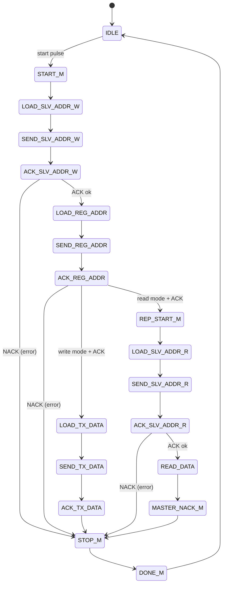

Every state either **drives** one of the building blocks above (via its `stat_en`) or **waits** for that block's `done` signal — the FSM itself contains almost no I2C timing logic; it just sequences the reusable pieces.

---

## 🎯 The Slave (`I2C_slave/`)

Built with the same "small pieces first" philosophy:

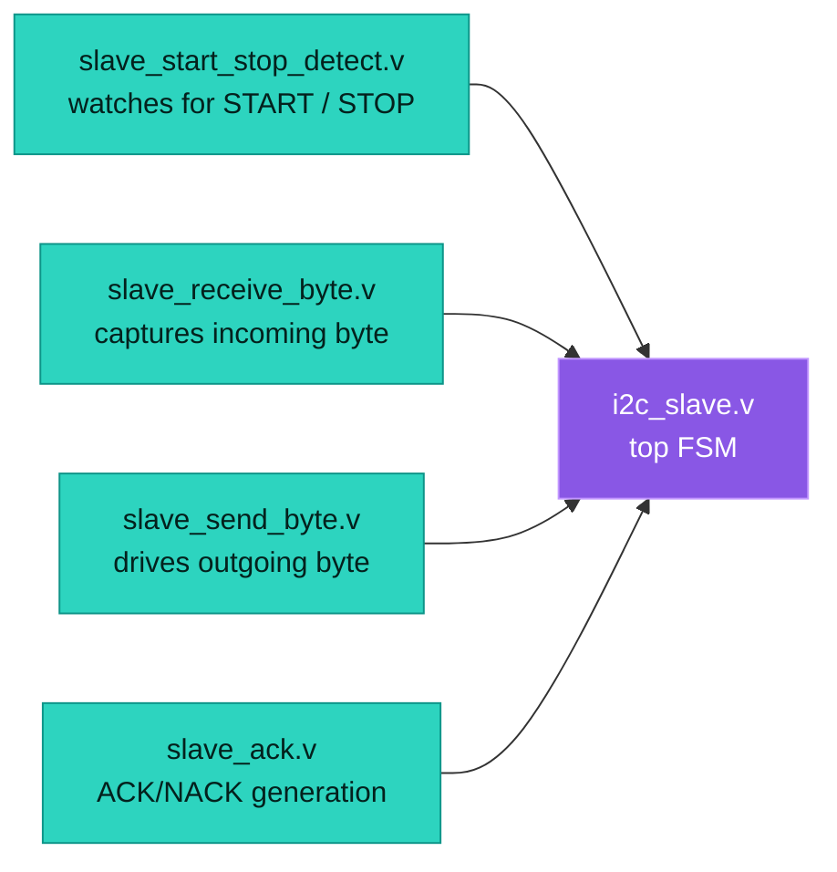

The slave constantly monitors SDA/SCL for edge patterns to detect START and STOP — it can't rely on a shared clock (it's asynchronous to the master) — then walks its own FSM: **address match → ACK → byte transfer → ACK → repeat or wait for STOP**.

`tb_i2c_two_slaves_behav.wcfg` is a saved waveform config for testing two slaves on the same bus, so you can confirm only the addressed slave responds.

---

## 🛠 Hardware Implementation (FPGA)

`Hardware_Implementation/FPGA_Single_Slave/` takes the simulation-only design and makes it **synthesizable and pin-mapped** for real boards:

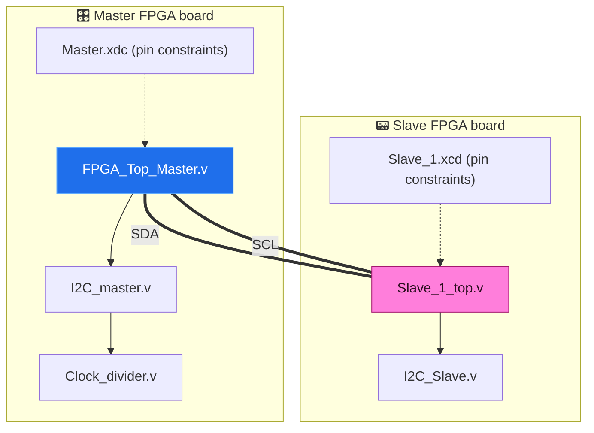

- `FPGA_Top_Master.v` wires up `i2c_master` with a target slave address (`7'h3C`) and register address, drives status LEDs for `done` and `ack_error`, and exposes `rx_data` for whatever you read back.
- `Clock_divider.v` slows the board's fast system clock down to a usable I2C SCL rate — FPGAs run at 10s–100s of MHz, while I2C typically runs at 100kHz–400kHz.
- `.xdc` / `.xcd` files are Xilinx constraint files mapping the Verilog ports (`clk`, `sda`, `sck`, buttons, LEDs) to actual physical pins on each board.
- `sck`/`sda` are declared `inout` and driven with `1'bz` / `1'b0` (**never** `1'b1`) — this is the open-drain behavior real I2C hardware needs, backed by external pull-up resistors on the board.

> 🏁 This is the payoff step: the exact same FSM and building blocks you simulated now run on silicon and talk across two physical boards over real wires.

---

## ▶️ How to Simulate

Using **Icarus Verilog** (`iverilog` + `vvp`), from inside any block's folder:

```bash
cd I2C_master/START_BIT
iverilog -o sim start_bit.v tb_start_bit.v
vvp sim
# open the generated .vcd in GTKWave to see the waveform
gtkwave dump.vcd
```

For the full master, simulate from `I2C_master/I2C_Master Final V/`:

```bash
cd "I2C_master/I2C_Master Final V"
iverilog -o sim i2c_master.v Clock_divider.v ack.v master_ack.v master_nack.v \
    read_byte.v repeated_start.v send_byte.v start_bit.v stop_i2c.v \
    i2c_slave.v tb_i2c_master.v
vvp sim
```

Or open any `.v`/testbench pair in **Vivado** / **ModelSim** if you prefer a GUI, and compare against the saved `OUTPUT_*.png` screenshots.

---

## 🧾 Signal Cheat Sheet

| Signal | Width | Meaning |
|:---|:---:|:---|
| `clk` | 1 | Board/system clock (fast) |
| `rst` / `rst_n` | 1 | Active-low reset |
| `start` | 1 | Pulse to kick off a transaction |
| `rw` | 1 | `0` = write, `1` = read |
| `slave_addr` | 7 | Target slave's I2C address |
| `reg_addr` | 8 | Register/command byte sent after the address |
| `tx_data` | 8 | Byte to write (write mode) |
| `rx_data` | 8 | Byte received (read mode) |
| `sda` | 1 (`inout`) | Data line — open-drain (`1'b0` or `1'bz`, never `1'b1`) |
| `sck` / `scl` | 1 (`inout`) | Clock line — open-drain, same rule |
| `done` | 1 | Transaction finished |
| `ack_error` | 1 | Slave failed to ACK (address or data rejected) |

---

## 🗺 Suggested Learning Order

If you're new to I2C or FSM-based design, go in this order — it mirrors how the repo itself was built:

1. **`I2C_master/START_BIT/`** — smallest possible module; understand the `stat_en → done` handshake
2. **`I2C_master/ADDRESS/send_bit/` → `send_byte/`** — see how 8 single-bit sends become one byte
3. **`I2C_master/ack/`** — understand ACK/NACK detection and generation
4. **`I2C_master/ADDRESS/read_byte/`**, **`Repeated_START/`**, **`stop/`** — the remaining pieces
5. **`I2C_master/I2C_Master V1/` → `V2/` → `Final V/`** — watch the FSM grow as pieces are added
6. **`I2C_slave/`** — same idea, from the slave's point of view
7. **`Hardware_Implementation/FPGA_Single_Slave/`** — see it become real, synthesizable, pin-mapped hardware

---

<div align="center">

Built as a hands-on way to learn the **I2C protocol** and **FSM-based digital design** in Verilog —
from a single wiggling wire to a working FPGA-to-FPGA link. ⚡

⭐ **If this helped you learn I2C, consider starring the repo!**

</div>
